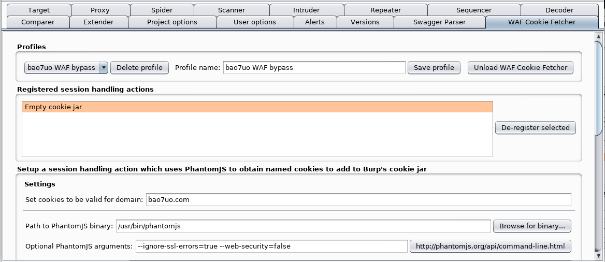
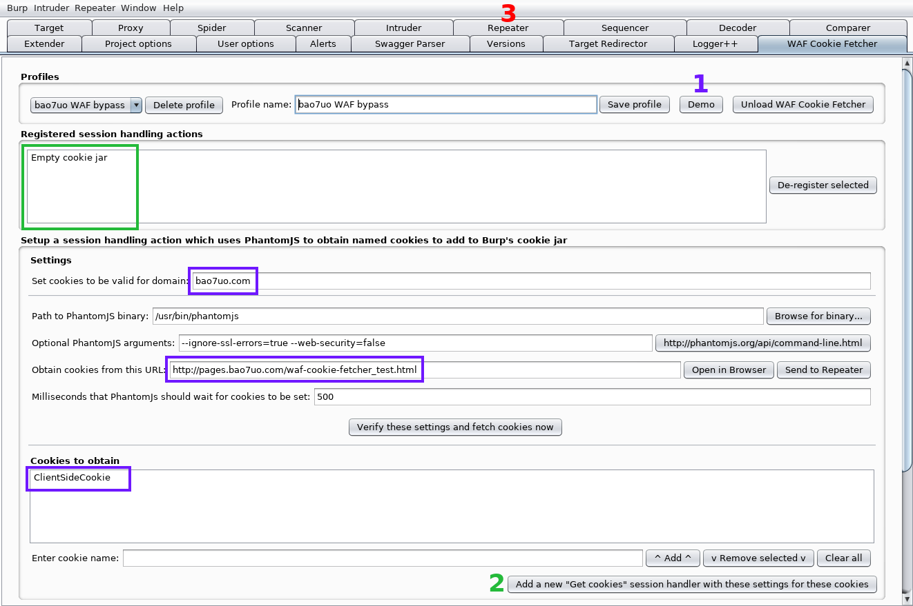
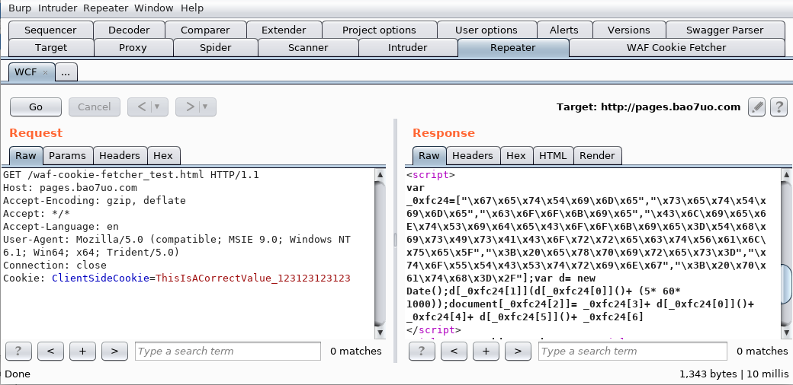
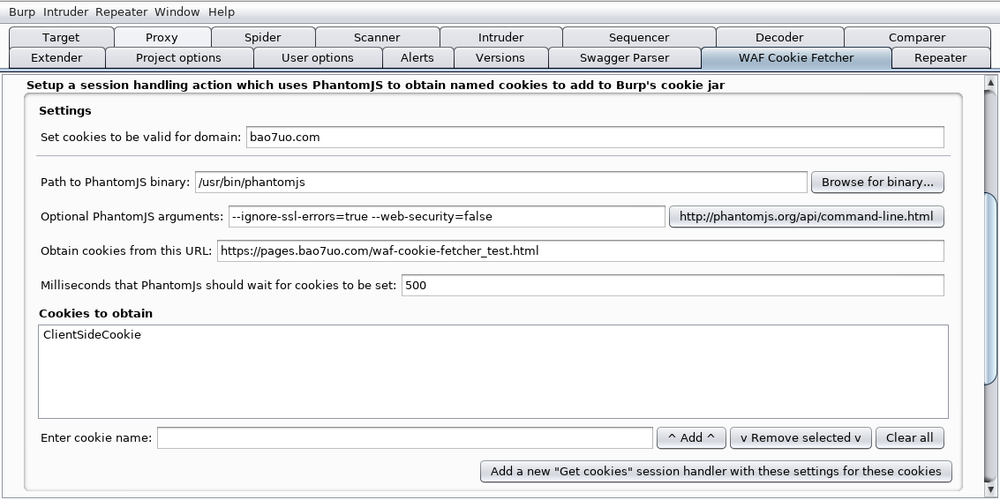

# WAF Cookie Fetcher - A Burp Suite Extension

#### This extension registers custom session handling rule actions which can...
- use a headless webkit/browser (PhantomJS) to obtain the values of WAF-injected cookies which are calculated in the browser by client-side JavaScript code and then add them to Burp's cookie jar
- selectively remove specific cookies from Burp's cookie jar
- empty Burp's cookie jar, for example to ensure only the desired cookies (or no cookies at all) are available to Burp

## Overview

WAF Cookie Fetcher is a Burp Suite extension which allows web application security testers to register various types of cookie-related session handling actions to be performed by the Burp session handling rules.

The extension can be used to add cookies to Burp's cookie jar which originate from a WAF or other bot defense system but are set in the browser using client-side code. Burp cannot normally detect updates to the values of these cookies without a request from the browser, which will not happen automatically during active scanning and intruder attacks etc. Therefore when the obfuscated new cookie value, or code to calculate the value is sent by the WAF's bot defense system, Burp doesn't update its cookie jar. This means that any requests which don't contain the updated value will be blocked. This makes it very difficult to use important Burp features such as the Scanner and Intruder when these bot defenses have been employed.

WAF Cookie Fetcher defeats these defense techniques by generating a generic PhantomJS script and calling the PhantomJS binary with the necessary parameters to run the script. The script then loads the web page and waits for the JavaScript to set the cookie, which is then returned by PhantomJS and picked up by the Burp extension. Tests showed that calling the PhantomJS binary was quicker than using Selenium etc. Using the binary directly also means that there are less dependencies to run WAF Cookie Fetcher.

The other action types allow features such as the removal of specific named cookies from Burp's cookie jar, and the ability to empty the whole jar. These additional features add some helpful flexibility when using more complex session handling rulesets, to ensure the session remains valid by avoiding problematic cookies or to ensure specific application code-paths are properly tested.

## Requirements

- Configure Burp Extender Python Environment (Jython standalone Jar)
- PhantomJS which can be downloaded and installed from http://phantomjs.org/download.html
- Supports Windows, Linux and Mac

## Demo instructions

A lab page is provided (hosted on GitHub Pages) to try out the extension.

Load WAF Cookie Fetcher extension in Burp. By default the extension contains the correct settings for the demo.

1. Click on the "Demo" button, which will populate the purple fields shown in the screenshot below.
2. Click on the "Add..." button which will populate the green field.
3. Go to the Repeater tab and use the automatically added WCF Demo request.

If a cookie appears and the value changes every time you click "Go" in repeater, then the demo is working. As you will be able to see, the JavaScript response from the server is obfuscated, but WAF Cookie Fetcher is obtaining the correct value and placing it in the cookie jar, and Burp is then adding it to the Repeater Request.

## Usage

### Burp session rules best practice

- It is preferable to use Burp's session management rules to check whether the session is valid so that this extension is only invoked when necessary, to avoid unnecessary PhantomJS requests. Any unnecessary requests could reduce Active Scan or Intruder Attack performance when they are relying on this extension.

### WAF Cookie Fetcher settings for obtaining cookies

The settings/fields shown in the following screenshot are explained in this section.

#### Set cookies to be valid for domain

- The cookies that are obtained by PhantomJS and added to Burp's cookie jar will be scoped to this domain

#### Path to PhantomJS binary

- Download and install PhantomJS from http://phantomjs.org/download.html
- Browse for the PhantomJS binary to populate this field

#### Optional PhantomJS arguments

- Allows PhantomJS to use a proxy server if necessary
- Check out http://phantomjs.org/api/command-line.html to see what options are available

#### Obtain cookies from this URL

- This is the URL that PhantomJS will open to obtain the cookies from

#### Milliseconds that PhantomJS should wait for cookies to be set

- Sometimes the client-side Javascript can take time to run, so this value sets a delay to wait for the cookie to become available to PhantomJS
- During testing, 500 ms seemed to be a reliable delay, but this value can be tuned as appropriate

#### Cookies to obtain

- Add the name of each desired cookie to the list

#### Adding the session handling action

- Once all of the above fields have been populated, click the 'Add a new "Get cookies" session handler' button to register the session handling action with Burp.

#### Using the rule

- In Burp's project options, sessions, rules, add a new rule action which invokes a Burp extension, choosing your new registered action
- Ensure that the rule is located before an appropriate 'Use cookies from Burp's cookie jar' rule
- For best results, it is usually appropriate to add a 'Check session is valid' rule action, located before the 'Get cookies' rule action.
- The .json file in the demo folder of this repository provides a simple example of a rule with working actions

## WAF Cookie Fetcher Roadmap

This project is still under development.

#### Potential future improvements:
- Improve UI
- Nomenclature
- MVC pattern
- Exception handling
- Source code optimisation

#### Potential future features may include:
- [x] "Test" button to pull in cookies and add them to list
- [x] Automatically add demo to session rules and repeater
- [x] Send target URL to repeater
- [ ] Demo to include Check session is valid action
- [ ] Burp session management configuration profiles (using load/saveConfigAsJson)
- [ ] Allow cookie names to be specified as a regex, or to add all cookies found by PhantomJS
- [ ] Get other types of data/fields from phantom
- [ ] Send to WAF Cookie Fetcher (support for alternative request methods and parameters)
- [ ] Templates for specific WAFs

## Contribute
Contributions, feedback and ideas will be appreciated.

## License notice

Copyright (C) 2017-2018 Paul Taylor

See LICENSE file for details.
